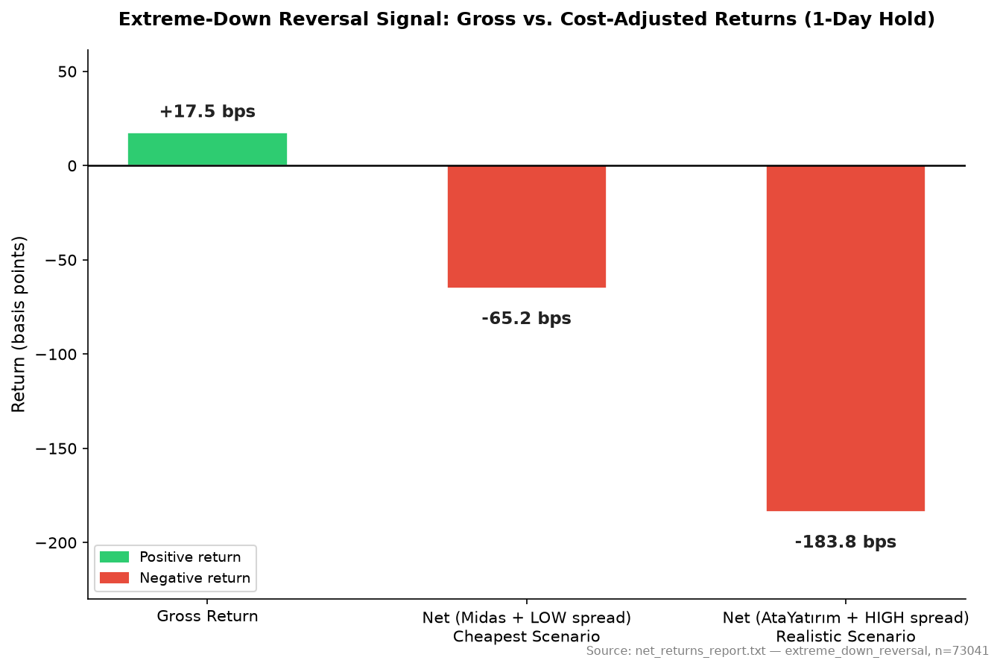

# BIST Systematic Signal Research


> **TL;DR:** Tested 20+ trading hypotheses on Turkish equities (BIST) — technical signals, PEAD, liquidity premium, IPO underpricing, information diffusion, index inclusion, and more. Result: no exploitable edge survives realistic transaction costs. Full methodology, code, and negative results documented below, including a worked notebook walkthrough and unit-tested core statistics.

## Overview

This repository tests four categories of hypotheses on Turkish equity markets (BIST), using daily OHLCV data fetched via borsapy/yfinance.

- **Technical signals**: 52-week breakout, volume-spike reversal, volatility compression breakout, laggard catchup
- **Event-driven**: extreme-down reversal, macro regime interaction (USDTRY/TLREF volatility), FX shock dates
- **Earnings surprise (PEAD)**: post-earnings announcement drift using KAP financial disclosures
- **Institutional flow proxies**: capital increase announcements, KAP insider trading filings, BTC wallet clustering pilot

## Methodology

- **Placebo controls**: signals retested on randomly-shifted dates to confirm results are not noise
- **Cost-inclusive backtesting**: broker commission scenarios (round-trip): Midas 1 bps, YapiKredi 22 bps, AtaYatirim 38 bps, HalkYatirim 64 bps; spread estimated as 10% (DUSUK) or 20% (YUKSEK) of daily HL range (avg 81.5 bps / 163 bps round-trip); total cost range: Midas+DUSUK=82.5 bps to HalkYatirim+YUKSEK=227 bps; Corwin-Schultz (2012) spread estimator used as an independent benchmark
- **BH-FDR correction**: Benjamini-Hochberg false discovery rate applied across multiple hypothesis tests
- **Look-ahead bias audits**: entry timing verified to use next-open (not same-day close); check_entry_timing.py flags violations
- **Walk-forward OOS validation**: walkforward_multi_signal.py runs rolling out-of-sample windows

## Key Findings

| Category | Result | Key Finding |
|---|---|---|
| Technical signals | No edge after costs | Extreme-down reversal: gross short-side excess +17.5 bps (1d), +31.8 bps (5d); net after Midas+DUSUK: -65 bps (1d), -51 bps (5d); net after AtaYatirim+YUKSEK: -184 bps (1d), -170 bps (5d); n=73,135 events, 576 symbols (net_returns_report.txt) |
| Event-driven | No edge | Macro regime (TLREF vol, YUKSEK/DUSUK) does not differentiate reversal returns: interaction term t-stat=0.35, p=0.72, N=1,437,255 (extreme_down_regime_regression.py) |
| PEAD / Earnings surprise | No edge — signal underperforms even placebo baseline | Brut excess t+5: -70 bps (t=-11.0, p<0.001), t+10: -46 bps (t=-5.2, p<0.001); placebo at t+5: +33 bps; signal directionally worse than random baseline (pead_signal_excess.py, pead_placebo_excess.py) |
| Institutional flow | No edge | Capital increase and insider trading pilots: insufficient signal frequency for robust test |
| Regime interaction (pre-registered) | No interaction edge | N=1,437,255; signal_strength:regime_dummy coeff=+1.98 bps (brut), t=0.35, p=0.72; direction correct per pre-registration but statistically insignificant (extreme_down_regime_regression.py) |
| Illiquid segment | Signal larger, cost larger, net more negative | extreme_down brut excess at 5d: -18.7 bps (t=-0.44, p=0.66); net Midas+DUSUK: -105 bps, AtaYatirim+YUKSEK: -264 bps; n=989 events in illiquid-only universe — cost expansion exceeds any signal gain vs. full universe (illiquid_scan_results.csv) |

See `notebooks/liquidity_premium_walkthrough.ipynb` for a full worked example (data loading → quartile classification → cost adjustment → statistical testing) of the liquidity premium test.



*Extreme-down reversal signal: gross return appears positive, but is fully erased once realistic transaction costs are applied (see net_returns_report.txt for full breakdown).*

## Notable Bugs Found and Fixed

- **Corwin-Schultz formula error**: original alpha formula used wrong coefficient; corrected to `(sqrt(2)-1)*sqrt(beta)/K - sqrt(gamma)/K` per Schultz (2012)
- **Entry-timing look-ahead**: several early scripts entered at same-day close instead of next-day open; check_entry_timing.py introduced to audit this systematically
- **KAP fetch windowing**: EVDS API returns ~1000-row limit per request; fetch_macro_regime.py now chunks by year
- **Duplicate/mislabeled scripts**: check_overlap_and_clustering.py is a copy of check_net_returns_cs.py; walkforward_framework.py contains diagnostic logic (not walk-forward), output renamed to avoid collision with diagnose_signals.py

## Repository Structure

| Category | Scripts | Description |
|---|---|---|
| Data acquisition | get_bist_data.py, get_bist_data_borsapy.py, fetch_kap_financial_reports.py, fetch_macro_regime.py | Download OHLCV, KAP disclosures, EVDS macro series |
| Data quality | check_data_quality.py, check_data_quality_borsapy.py, find_bad_csv.py, inspect_outliers.py, check_limit_moves.py | Validate data, find splits/limit moves, outlier inspection |
| Signal scanning | comprehensive_scan.py, liquidity_filtered_scan.py, illiquid_segment_scan.py, vol_compression_breakout.py, vol_compression_breakout_v2.py | Cross-sectional event detection |
| Net return / cost | check_net_returns.py, check_net_returns_cs.py, check_net_returns_simple_proxy.py | Cost-adjusted return analysis at multiple bps assumptions |
| Diagnostics | diagnose_signals.py, signal_overlap_check.py, event_concentration_check.py, event_frequency_and_post_drift.py | Overlap, concentration, and drift checks |
| Walk-forward | walkforward_multi_signal.py | Rolling OOS validation (use this, not walkforward_framework.py) |
| PEAD / Earnings | pead_signal_backtest.py, pead_placebo_test.py, pead_signal_excess.py, pead_placebo_excess.py, pead_earnings_surprise_pilot.py | PEAD hypothesis tests with placebo controls |
| Regime / Macro | regime_backtest.py, fetch_macro_regime.py, extreme_down_regime_regression.py, usdtry_bist_analysis.py | Macro volatility regime interaction |
| Pilots | capital_increase_pilot.py, kap_insider_trading_pilot.py, btc_wallet_clustering_pilot.py | Exploratory institutional flow proxies |
| Capacity | capacity_backtest.py | Slippage scaling with position size |

## Testing

Run `pytest tests/` to verify core statistical functions (Corwin-Schultz spread estimator, BH-FDR correction).

## Usage

`run_all.py` is the single entry point for running the analyses. Each analysis executes its own script unchanged (via `runpy`), so results are identical to running the scripts directly.

```bash
# List all available analyses with one-line descriptions
python run_all.py --list

# Run a single analysis by name
python run_all.py --analysis liquidity_premium
python run_all.py --analysis vol_compression_v2
python run_all.py --analysis walkforward

# Run every registered analysis in order (continues past failures,
# prints a pass/fail summary at the end)
python run_all.py --all
```

Data-acquisition scripts (`get_*`, `fetch_*`) and one-off KAP API debug scripts (`test_kap_*`, `test_date_type.py`, etc.) are not registered in `run_all.py` — they require network access / API keys and are run manually as needed. Most analyses expect `data/` to be populated first (see Requirements below).

## Requirements

```
pip install pandas numpy yfinance borsapy evds statsmodels scipy
```

- `config/symbols.txt`: one BIST ticker per line (required by most scan scripts)
- `data/`: directory of per-symbol OHLCV CSV files (Date, Open, High, Low, Close, Volume)
- `data_macro/`: output directory for EVDS macro series (auto-created)
- EVDS API key required for `fetch_macro_regime.py` — copy `.env.example` to `.env` and set `EVDS_API_KEY`

## Archived code

`vol_compression_breakout.py` (v1) and `walkforward_framework.py` have been archived — see `archive/` for historical versions. Use `vol_compression_breakout_v2.py` and `walkforward_multi_signal.py` instead. `archive/vol_compression_breakout_results.csv` is the v1 output; `vol_compression_breakout_results_v2.csv` (repo root) is the current v2 output. The `archive/utils/`, `archive/data_sources/`, and `archive/processors/` folders are leftover skeleton code from an unrelated project.
